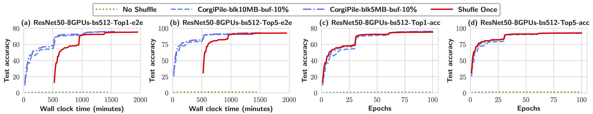
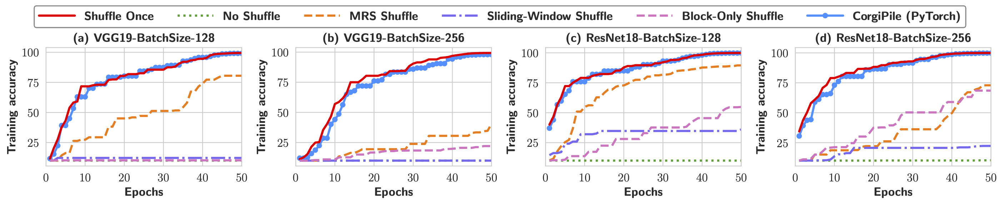
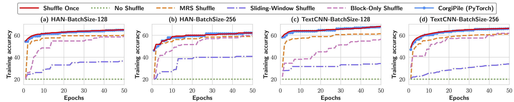

# CorgiPile-PyTorch
The implementation of CorgiPile in PyTorch.

# Introduction

CorgiPile is a novel two-level hierarchical data shuffle mechanism for efficient SGD computation in both deep learning and in-DB ML systems. The main idea is to first sample and shuffle the data at block level, and then shuffle data at tuple level within the sampled data blocks, i.e., first sampling data blocks, then merging the sampled blocks in a buffer, and finally shuffling the tuples in the buffer for SGD. Compared with existing mechanisms, CorgiPile can avoid the full shuffle while maintaining comparable convergence rate as if a full shuffle were performed.

We have implemented CorgiPile inside PyTorch, by designing new parallel/distributed shuffle operators as well as a new DataSet API. Extensive experimental results show that our CorgiPile in PyTorch can achieve comparable convergence rate with the full-shuffle based SGD, and 1.5X faster than PyTorch PyTorch with full data shuffle on ImageNet dataset.


# How to run CorgiPile-PyTorch? 

The following steps describe how to use CorgiPile-PyTorch to train deep learning models on ImageNet, cifar-10, and yelp-review-full datasets.

## Install Python packages
Install necessary Python packages such as `torch`, `torchvision`, `torchtext`, `numpy`, `nltk` and `pandas`, through `pip` or `conda`.

## Download the datasets

Download the following datasets. Decompress them into a directory like 'corgipile_data'.
1. [ImageNet dataset](https://www.image-net.org/download.php)
2. [cifar-10 dataset](http://www.cs.toronto.edu/~kriz/cifar-10-python.tar.gz)
3. [yelp-review-full dataset](https://drive.google.com/uc?export=download&id=0Bz8a_Dbh9QhbZlU4dXhHTFhZQU0)


## Data preprocessing

### 1. ImageNet data preprocessing

ImageNet dataset contains 1.2 million raw images. It is usually not feasible to load all the images into memory, and it is slow to (randomly) access each image on block-based parallel/distributed file systems such as [Lustre](https://www.lustre.org/) and HDFS. Therefore, in a parallel/distributed cluster, we usually transform the ImageNet dataset into binary format like TFRecord used by TensorFlow (https://www.tensorflow.org/api_docs/python/tf/data/TFRecordDataset) and PyTorch (https://github.com/vahidk/tfrecord).

Run [images_raw_to_tfrecord.py](imagenet_dl_bench/pre_process/images_raw_to_tfrecord.py) to transform the ImageNet dataset.
The code contains annotations for some important configurations. The transformed data contains four files, including `train/train_clustered.tfrecord`, `train/train_clustered.index`, `val/val_clustered.tfrecord`, and `val/val_clustered.index`.


### 2. cifar-10 data preprocessing

We do not need to preprocess cifar-10, which can be loaded into memory.


### 3. yelp-review-full data preprocessing

We train HAN and TextCNN models on this NLP dataset based on the code from https://github.com/Renovamen/Text-Classification. To perform these models, we need to transform this dataset into docs and sentences in advance. 
Feel free to use the [nlp_dl_bench/preprocess.py](nlp_dl_bench/preprocess.py) to perform this transformation. You can also refer to this [guide](https://github.com/Renovamen/Text-Classification) for details. 


# Train deep learning models on the above datasets


## Data shuffling strategies for SGD

**1. Once Shuffle:** This strategy performs an offline shuffle of all data tuples, by storing the shuffled tuples as a copy on the file system.
SGD is then executed over this shuffled copy without any further shuffle during the execution of SGD.

**2. No Shuffle:** This strategy does not perform any data shuffle at all, i.e., the SGD algorithm runs over the given data order in each epoch. 

**3. Sliding-Window Shuffle:** This [strategy](https://www.tensorflow.org/api_docs/python/tf/data/Dataset)leverages a sliding window to perform *partial* data shuffling, which is used by TensorFlow. 

**4. Multiplexed Reservoir Sampling Shuffle (MRS Shuffle):** This [strategy](https://www.cs.stanford.edu/people/chrismre/papers/bismarck.pdf) uses two concurrent threads to read tuples and update a shared model. 
The first thread sequentially scans the dataset and performs *reservoir sampling*.
The sampled (i.e., selected) tuples are stored in a buffer $B_1$ and the dropped (i.e., not selected) ones are used for SGD. 
The second thread loops over the sampled tuples using another buffer $B_2$ for SGD, where tuples are simply copied from the buffer $B_1$.

**5. CorgiPile Shuffle:** Out two-level shuffle as mentioned in the introduction.


## Train ResNet50 on ImageNet dataset

Use [imagenet_dl_bench/normal_node/imagenet_corgipile_raw_train.py](imagenet_dl_bench/normal_node/imagenet_corgipile_raw_train.py) to train the ResNet50 model on the ImageNet dataset. This code is similar to that of the official [PyTorch-ImageNet code](https://github.com/pytorch/examples/blob/main/imagenet/main.py). The main difference is that our code contains multiple data shuffling strategies such as 'no_shuffle', 'corgipile_shuffle (block)', and 'once_shuffle'. This code can run on multiple GPUs.

## Train VGG19 and ResNet18 on cifar-10 dataset

Use [cifar_dl_bench/cifar_dl_bench_train.py](cifar_dl_bench/cifar_dl_bench_train.py) to train the VGG19 or ResNet18 models on the cifar-10 dataset. This code runs on 1 GPU. Users can choose different data shuffling strategies as mentioned in the **Data shuffling strategies for SGD**.


## Train HAN and TextCNN on yelp-review-full dataset

Use [nlp_dl_bench/nlp_dl_bench_train.py](nlp_dl_bench/nlp_dl_bench_train.py) to train the HAN or TextCNN models on the  yelp-review-full dataset. This code runs on 1 GPU. Users can choose different data shuffling strategies as mentioned in the **Data shuffling strategies for SGD**.


## Training logs

The training logs are automatically stored in the user-defined log files as follows.

```
[params] use_clustered_data = True
[params] use_train_accuracy = True
[params] use_sgd = True
[params] model_name = ResNet18
[params] batch_size = 128
[params] iter_num = 10
[params] learning_rate = 0.001
[params] num_workers = 1
[params] data_name = cifar10
[params] lr_decay = 0.95
[params] resume = False
[params] data_dir = XXX/data/
[params] download = False
[params] saving = False
[params] block_num = 500
[params] buffer_size_ratio = 0.1
[params] sliding_window_size_ratio = 0.1
[params] bismarck_buffer_size_ratio = 0.1
[params] shuffle_mode = once_shuffle
[params] log_file = XXX/train_log_cifar10_sgd/cifar10/ResNet18/sgd-bs128/once_shuffle/once_shuffle_cifar10_lr0.001_2022-06-08-21-32-38.txt
[2022-06-08 21:32:38] Start iteration
==> Building model..
[2022-06-08 21:33:23] [Epoch  1] Loss = 540.40, acc = 49.22, exec_t = 42.06s, grad_t = 22.53s, loss_t = 19.53s
[2022-06-08 21:34:05] [Epoch  2] Loss = 429.50, acc = 60.47, exec_t = 41.79s, grad_t = 21.69s, loss_t = 20.10s
[2022-06-08 21:34:45] [Epoch  3] Loss = 359.05, acc = 67.31, exec_t = 40.25s, grad_t = 20.82s, loss_t = 19.42s
[2022-06-08 21:35:26] [Epoch  4] Loss = 326.89, acc = 70.10, exec_t = 40.59s, grad_t = 20.90s, loss_t = 19.69s
[2022-06-08 21:36:06] [Epoch  5] Loss = 283.51, acc = 74.40, exec_t = 40.55s, grad_t = 20.85s, loss_t = 19.69s
[2022-06-08 21:36:47] [Epoch  6] Loss = 261.78, acc = 76.35, exec_t = 40.52s, grad_t = 20.71s, loss_t = 19.81s
[2022-06-08 21:37:27] [Epoch  7] Loss = 230.30, acc = 79.30, exec_t = 39.76s, grad_t = 20.59s, loss_t = 19.17s
[2022-06-08 21:38:07] [Epoch  8] Loss = 213.26, acc = 80.95, exec_t = 40.20s, grad_t = 20.87s, loss_t = 19.33s
[2022-06-08 21:38:47] [Epoch  9] Loss = 203.41, acc = 81.92, exec_t = 39.97s, grad_t = 21.08s, loss_t = 18.89s
[2022-06-08 21:39:27] [Epoch 10] Loss = 200.30, acc = 82.27, exec_t = 39.67s, grad_t = 21.11s, loss_t = 18.56s
[2022-06-08 21:39:27] [Finish] avg_exec_t = 40.53s, avg_grad_t = 21.12s, avg_loss_t = 19.42s
[2022-06-08 21:39:27] [-first] avg_exec_t = 40.37s, avg_grad_t = 20.96s, avg_loss_t = 19.41s
[2022-06-08 21:39:27] [-1 & 2] avg_exec_t = 40.19s, avg_grad_t = 20.87s, avg_loss_t = 19.32s
[2022-06-08 21:39:27] [MaxAcc] max_accuracy = 82.27

```


# Experimental results

## ImageNet

The convergence rates of ResNet50 with different data shuffling strategies, for the clustered ImageNet dataset. TopN refers to the Top-N accuracy.




## cifar-10
The convergence rates of deep learning models with different data shuffling strategies and batch
sizes, for the clustered 10-class cifar-10 image dataset.



## yelp-review-full
The convergence rates of deep learning models with different data shuffling strategies and batch
sizes, for the clustered 5-class yelp-review-full text dataset.


